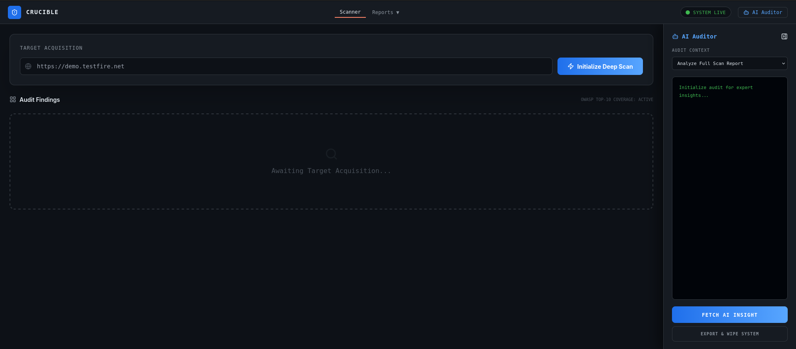
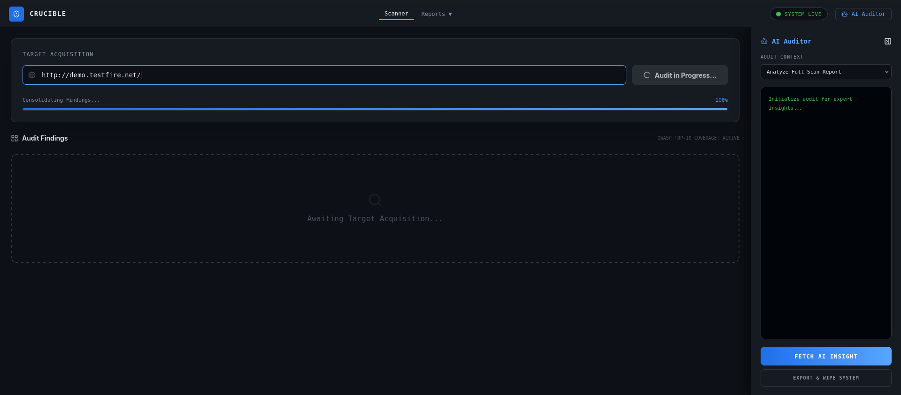
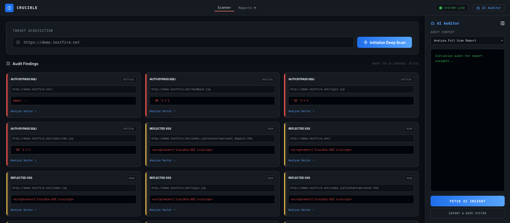
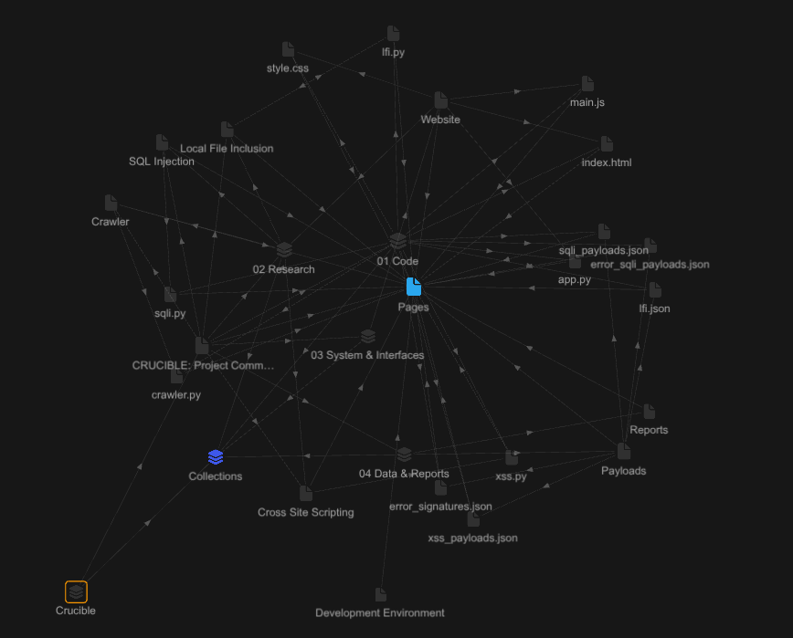

# Crucible: Multi-Engine Web Vulnerability Scanner

Crucible is a modular Dynamic Application Security Testing (DAST) framework designed to identify and audit web-based vulnerabilities. Developed with a focus on automation, it integrates a web crawler with specialized injection engines, an AI-powered audit assistant, and a centralized Flask-based management dashboard.


---

## Core Features

- **Automated Discovery**  
  Implements a Breadth-First Search (BFS) crawler to map target domains and identify attack surfaces such as HTML forms and URL parameters.

- **SQL Injection Engine**  
  Detects SQL injection vulnerabilities across multiple vectors: authentication bypass, error-based signature detection, and time-based blind injection. Runs candidates concurrently via a thread pool for faster coverage.

- **Cross-Site Scripting Engine**  
  Identifies reflected XSS vulnerabilities by testing whether injected payloads are returned unescaped in server responses. Fully parallelized with `ThreadPoolExecutor`.

- **AI Audit Assistant**  
  Integrates Google Gemini 2.5 Flash as a Senior Security Auditor. After a scan, the AI analyses findings and returns technical remediation advice — including specific code-level fixes — rendered inline in the dashboard terminal.

- **Centralized Reporting**  
  A GitHub-style dark web dashboard for real-time scan monitoring, structured vulnerability output, and persistent JSON report history. Includes a secure Export & Wipe function that downloads the report and deletes it from disk in one action.

- **Modern Development Stack**  
  Managed via the `uv` package manager for high-performance dependency handling and environment isolation.

---

## Technical Stack

- **Backend:** Python 3.10.19, Flask
- **AI Integration:** Google Gemini 2.5 Flash (`google-generativeai`)
- **Package Management:** uv
- **Scanning Engine:** lxml, BeautifulSoup4, `concurrent.futures`
- **Frontend:** HTML5, Tailwind CSS, Vanilla JavaScript, Lucide Icons
- **Environment:** Developed on ASUS TUF F17, compatible with Windows and Linux/WSL environments

---

## Installation

This project requires **Python 3.10.19**, the **uv package manager**, and a **Google Gemini API key**.

**1. Repository Setup**
```bash
git clone https://github.com/RitabrataDutta01/Crucible.git
cd crucible
```

**2. Environment Configuration**
```bash
uv venv

# Windows:
.venv\Scripts\activate

# Linux / macOS:
source .venv/bin/activate

uv sync
```

**3. Dependencies**
```bash
uv add flask requests beautifulsoup4 lxml python-dotenv google-generativeai
```

**4. API Key Setup**

The AI Auditor requires a Google Gemini API key set as an environment variable:

```bash
# Linux / macOS:
export GOOGLE_API_KEY="your_key_here"

# Windows (PowerShell):
$env:GOOGLE_API_KEY="your_key_here"
```

---

## Usage

1. Launch the application:
    ```bash
    uv run python app.py
    ```
2. Access the dashboard at `http://127.0.0.1:5000`.
3. Input the target URL and initiate a Deep Scan.
4. Review the findings grid for identified endpoints, payloads, and severity ratings.
5. Open the **AI Auditor** panel and click **Fetch AI Insight** to get Gemini-powered remediation advice for your findings.
6. Use **Export & Wipe** to download the report as JSON and securely delete it from the server.

---

## Project Structure

```text
crucible/
├── app.py              # Application entry point, Flask routing, Gemini integration
├── packages/           # Modular vulnerability engines
│   ├── crawler.py      # BFS web crawling and form extraction
│   ├── sqli.py         # Multi-vector SQLi detection (threaded)
│   └── XSS.py          # Reflected XSS detection (threaded)
├── static/
│   ├── css/style.css   # GitHub-style dark theme
│   └── js/main.js      # Scan progress, AI bridge, modal logic
├── templates/
│   └── index.html      # Main dashboard (Tailwind + Lucide)
├── data/               # Security payloads and signature data
├── reports/            # JSON logs of completed scans
└── pyproject.toml      # Dependency and project metadata
```

---

## Finding Schema

Every finding produced by the injection engines conforms to a unified schema to ensure consistent rendering across the dashboard and report files:

```json
{
  "vulnerability type": "Reflected XSS",
  "url":      "http://target.com/page",
  "payload":  "<script>alert(1)</script>",
  "severity": "High",
  "evidence": "Payload reflected verbatim in response from http://target.com/search",
  "endpoint": "http://target.com/search",
  "method":   "GET"
}
```

---

## Safe Test Targets

> Only scan applications you own or have explicit written permission to test.

| Target | URL |
|---|---|
| Altoro Mutual (IBM) | `http://demo.testfire.net` |
| VulnWeb | `http://testphp.vulnweb.com` |

---

Preview-


---

---

---


---

## Ongoing Development

The following modules are currently in development as part of the Crucible expansion roadmap:

- **Local File Inclusion (LFI) Engine** — auditing URL parameters for directory traversal and sensitive file access.
- **Header Security Auditor** — analysis of HTTP response headers for security misconfigurations (CSP, HSTS, X-Frame-Options).
- **Machine Learning Integration** — implementation of a Naive Bayes classifier to improve detection accuracy and reduce false positives.

---

## Note

If using the "Crucible-Scanner.exe" from the releases, after double clicking on the exe file please go to your web browser and go to localhost:5000 and then use.

---

## Disclaimer

Crucible is intended for educational purposes and authorized penetration testing only. Unauthorized use of this tool against systems without explicit permission is illegal. The developer assumes no liability for misuse.

---

## Author

**Ritabrata Dutta**  
Second-year B.Tech Student, Computer Science & Engineering  
Adamas University, West Bengal, India