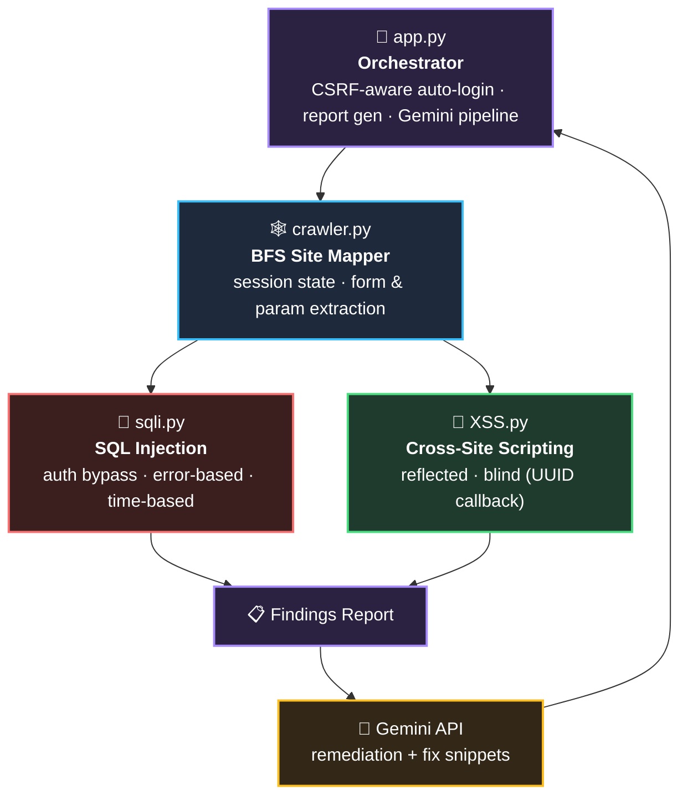
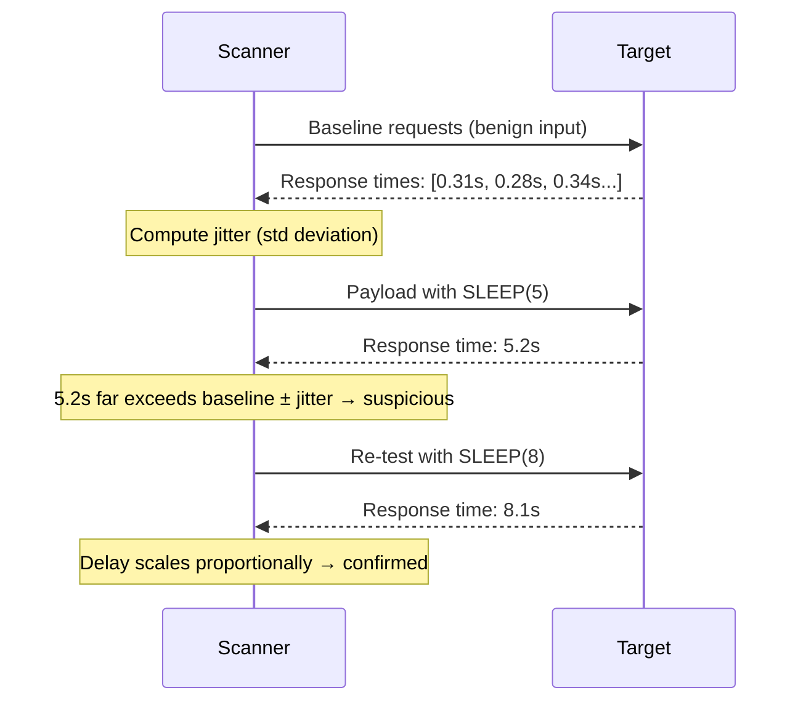
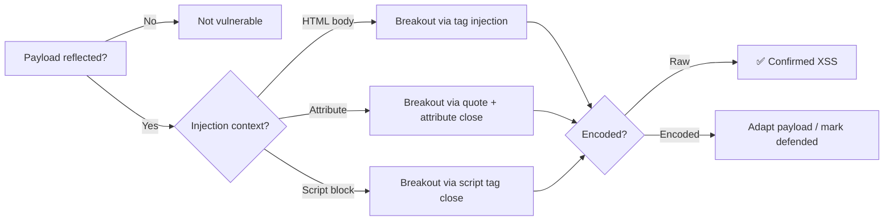

<div align="center">

# 🔥 Crucible

**A multi-engine DAST scanner that thinks statistically, not just syntactically.**

[](https://python.org)
[](https://flask.palletsprojects.com/)
[]()
[]()

Crawls a target, finds real vulnerabilities using statistical validation instead of guesswork, and explains every finding in plain English via an AI remediation pipeline.

</div>

---

## Table of Contents

- [🔥 Crucible](#-crucible)
  - [Table of Contents](#table-of-contents)
  - [Why Crucible](#why-crucible)
  - [Architecture](#architecture)
  - [How It Works](#how-it-works)
    - [🕸️ Crawler — BFS Traversal](#️-crawler--bfs-traversal)
    - [💉 SQL Injection — Statistical Time-Based Detection](#-sql-injection--statistical-time-based-detection)
    - [🎯 XSS — Context-Aware Reflection + Blind XSS via UUID Callbacks](#-xss--context-aware-reflection--blind-xss-via-uuid-callbacks)
    - [🤖 AI-Assisted Reporting](#-ai-assisted-reporting)
  - [Design Decisions](#design-decisions)
  - [Tech Stack](#tech-stack)
  - [Getting Started](#getting-started)
  - [Roadmap to v1.0](#roadmap-to-v10)
  - [Disclaimer](#disclaimer)

---

## Why Crucible

Most toy scanners fire a fixed payload and grep the response. That approach drowns in false positives the moment network jitter, dynamic content, or basic encoding enters the picture.

Crucible is built around a different premise at every layer: **establish a baseline before deciding anything is anomalous.** Whether that's response-time jitter for time-based SQLi or encoding behavior for XSS, nothing gets flagged as a vulnerability until it's been checked against what "normal" looks like for that specific target.

## Architecture



The pipeline is deliberately linear and decoupled: the crawler has no knowledge of SQLi or XSS, and the detection engines have no knowledge of crawling. `app.py` is the only component that understands the full flow, so each engine can be tested, swapped, or extended independently.

## How It Works

### 🕸️ Crawler — BFS Traversal

The crawler uses breadth-first search (`collections.deque`) rather than depth-first recursion, for two reasons:

| | |
|---|---|
| **Bounded coverage** | DFS can burrow many links deep down one branch before ever reaching a shallow, easily-testable page. BFS guarantees every page at depth 1 is covered before depth 2 — critical when a scan runs on a time budget. |
| **Simple cycle safety** | A queue plus a `visited` set is the cleanest correct way to avoid infinite loops on sites with circular navigation, which is most real sites. |

The crawler carries authenticated session state through the traversal, filters unsafe/untestable links (`logout`, static assets like `.pdf`), and extracts every form and query parameter — this becomes the attack surface handed to the detection engines.

### 💉 SQL Injection — Statistical Time-Based Detection

The naive approach — send `SLEEP(5)`, see if the response takes 5 seconds, call it vulnerable — produces constant false positives, since server load and network variance can add multi-second delays with zero relation to SQL injection.



1. **Baseline first** — several benign requests establish normal response time, HTTP status, and length for *this* target, not a hardcoded number.
2. **Standard deviation as the signal** — a delay only counts as suspicious if it falls well outside the baseline's natural jitter.
3. **Secondary confirmation** — a genuine time-based SQLi scales its delay with the injected sleep value; a network fluke won't reproduce consistently.

The same baseline-first philosophy carries into the **error-based** vector (comparing against baseline content/length, not just grepping for `SQL syntax`) and the **auth bypass** vector (checking for genuine state change, not just a different response length). All three vectors run concurrently via threading.

### 🎯 XSS — Context-Aware Reflection + Blind XSS via UUID Callbacks

A fixed `<script>alert(1)</script>` payload behaves completely differently depending on where it lands — HTML body, an attribute, or inside a `<script>` block each demand a different breakout strategy.



**Blind XSS** covers payloads that fire out-of-band — e.g. in an admin panel the scanner never visits. Each payload is tagged with a unique UUID and paired with a public callback endpoint (ngrok). Whenever it executes, the callback server logs the ping with its UUID, which is correlated back to the exact parameter that planted it. It's the only way to catch stored XSS firing in a context outside the scanner's own crawl.

### 🤖 AI-Assisted Reporting

`app.py`'s `get_ai_analysis` sends each finding's technical detail to the Gemini API and gets back plain-English remediation guidance and example fix code — turning "time-based SQLi confirmed on `id`, 5.2s delay vs 0.3s ± 0.08s baseline" into something immediately actionable for a developer without a security background.

## Design Decisions

| Decision | Why |
|---|---|
| BFS over DFS crawling | Bounded, predictable breadth-first coverage instead of getting lost down one branch |
| Statistical baselining over fixed thresholds | Every target has different latency; a fixed cutoff doesn't generalize and false-positives constantly |
| Context detection before payload selection | A payload effective in an attribute often fails inside a `<script>` block — testing blind wastes requests and misses real vulns |
| UUID-tagged callbacks for blind XSS | Out-of-band vulnerabilities are invisible to a scanner inspecting only its own responses — a unique ID per payload is the only way to attribute a delayed trigger |
| Decoupled engine architecture | Crawler and detection engines share no state beyond the target list — each is independently testable and replaceable |
| Threaded concurrency | Statistical baselining needs multiple requests per endpoint; concurrent vectors keep scan time from scaling linearly |

## Tech Stack

<div align="left">


</div>

## Getting Started

```bash
git clone https://github.com/RitabrataDutta01/Crucible.git
cd Crucible
pip install -r requirements.txt
python app.py
```

> ⚠️ Requires a local, authorized test target such as DVWA. Never point Crucible at an application you don't own or lack explicit written permission to test.

## Roadmap to v1.0

- [ ] Unify finding schemas across `sqli.py` and `XSS.py` into one reporting format
- [ ] Fix path loading (currently environment-dependent)
- [ ] Remove dead code from earlier iterations
- [ ] Bundle a sandboxed live demo (DVWA / OWASP Juice Shop via docker-compose) — never expose the scanner against a public target
- [ ] Tag `v1.0` release

> LFI and RCE modules exist as early proofs of concept and are being developed separately before integration — intentionally out of scope for this repo for now.

## Disclaimer

Crucible is intended for authorized security testing and educational purposes only. Running it against systems without permission is illegal. The author is not responsible for misuse.

---

<div align="center">
<sub>Built by <a href="https://github.com/RitabrataDutta01">Ritabrata Dutta</a></sub>
</div>